Gallery
=======

Some of these carpets were mentioned (and therefore inspired) by link:https://friendlyfieldsandopenmaps.com/2017/09/18/the-pi-fractal/[jrhodkinson].

Carpets
-------

.2x2-7-000000FF
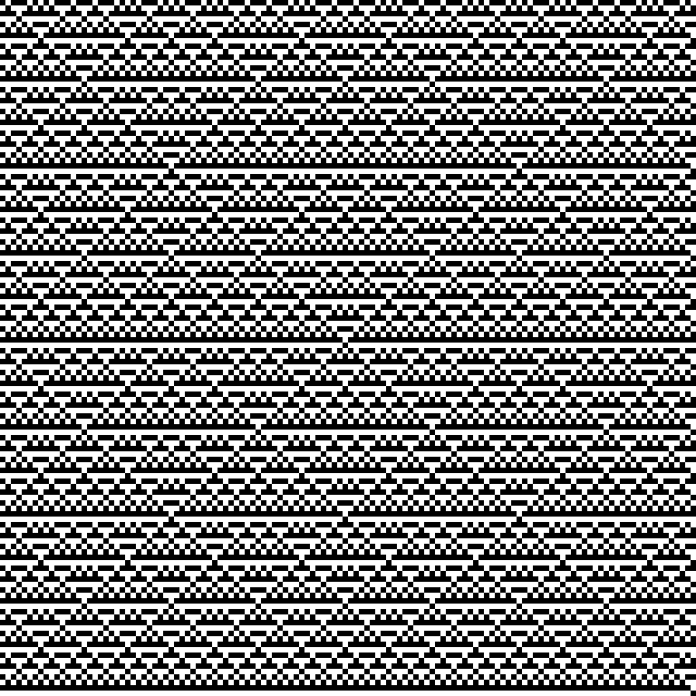
.cartesian-5-FFFFFFFF
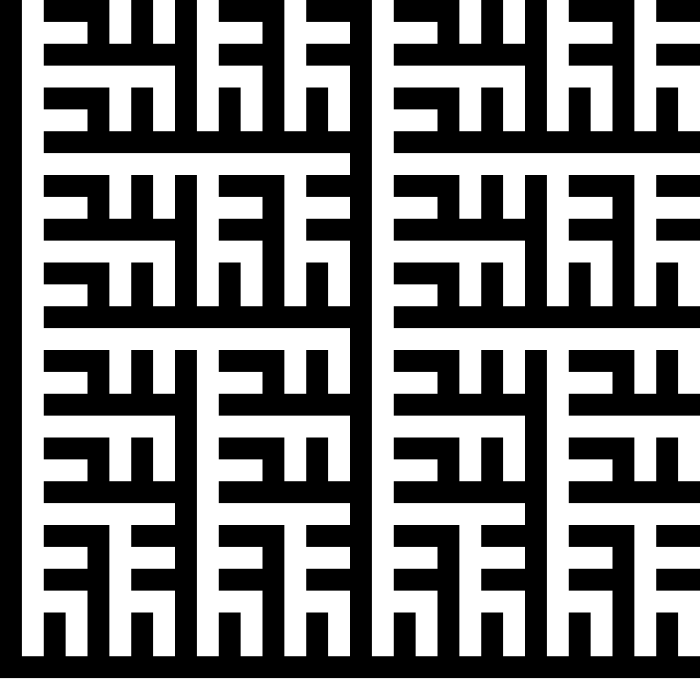
.cross-6-4084A6FF
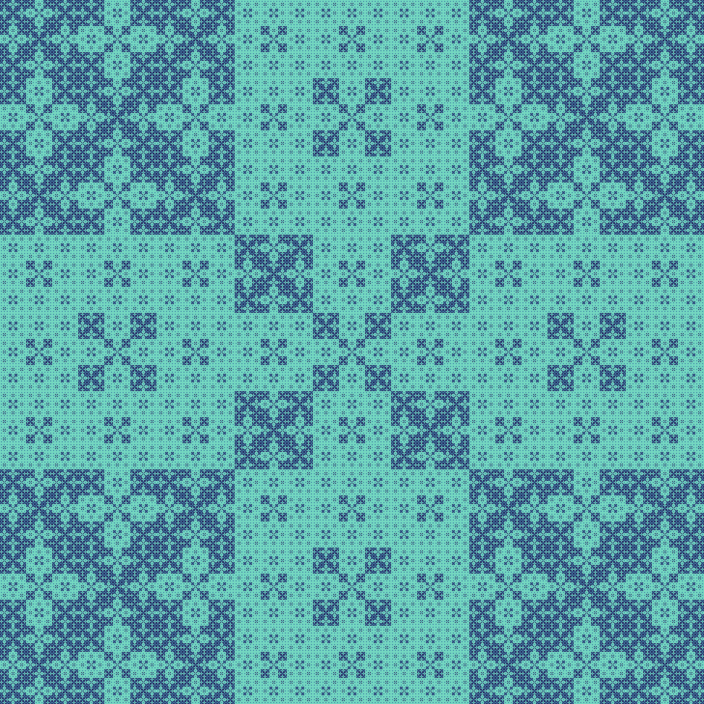
.geo-4-FFFFFFFF
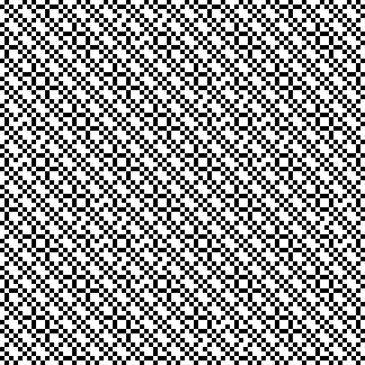
.guided-4-000000FF
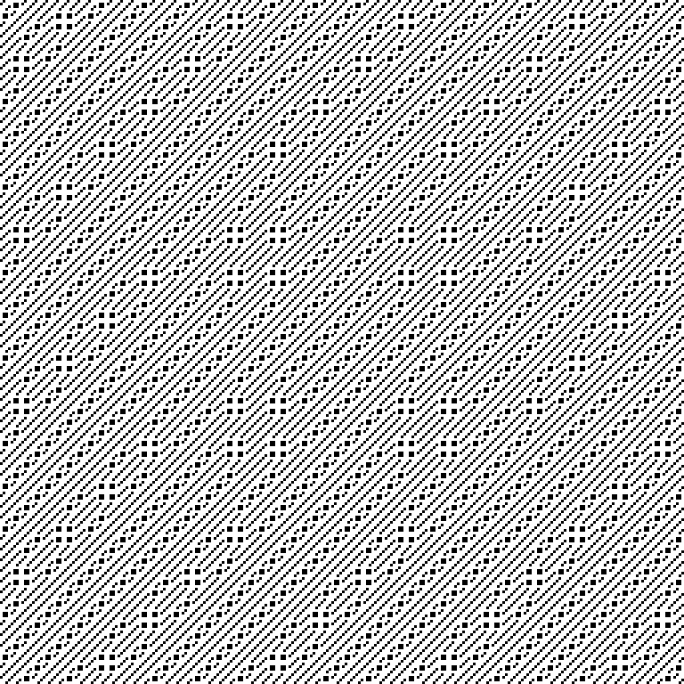
.haferman-2-000000FF
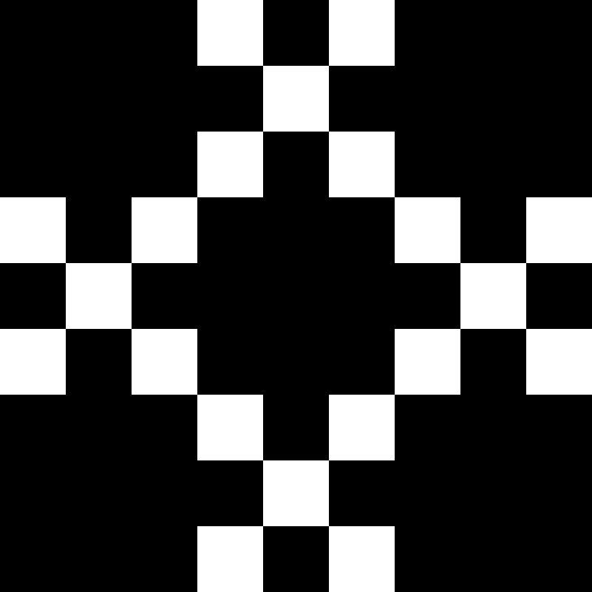
.haferman-3-000000FF

.haferman-3-FFFFFFFF
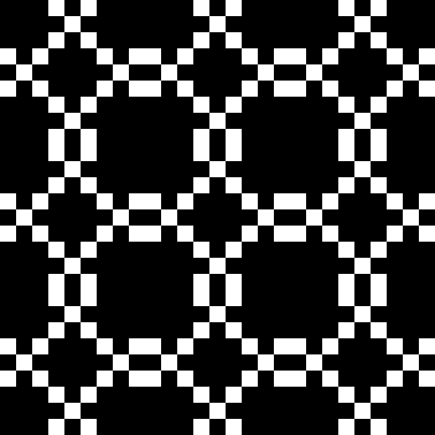
.haferman-4-000000FF

.haferman-4-FFFFFFFF
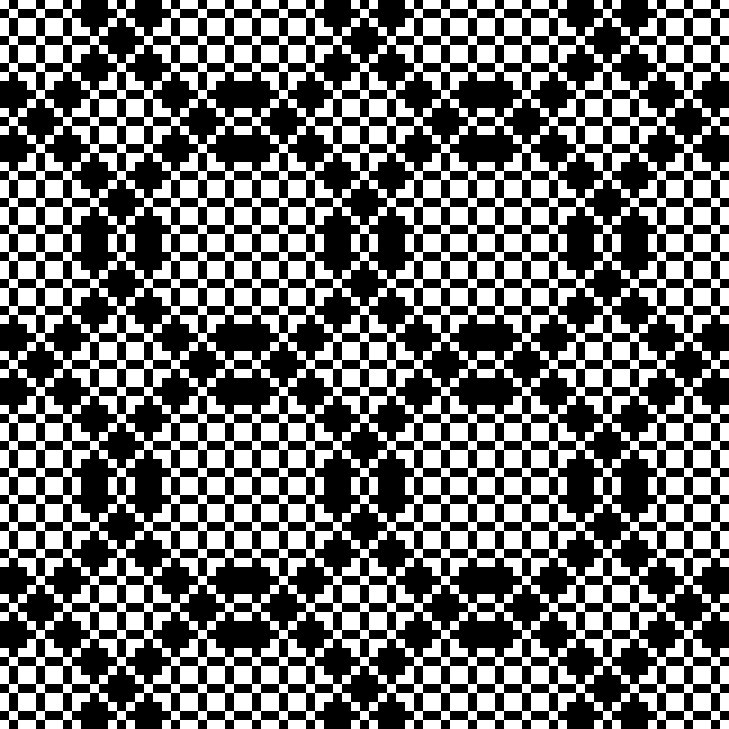
.haferman-5-000000FF
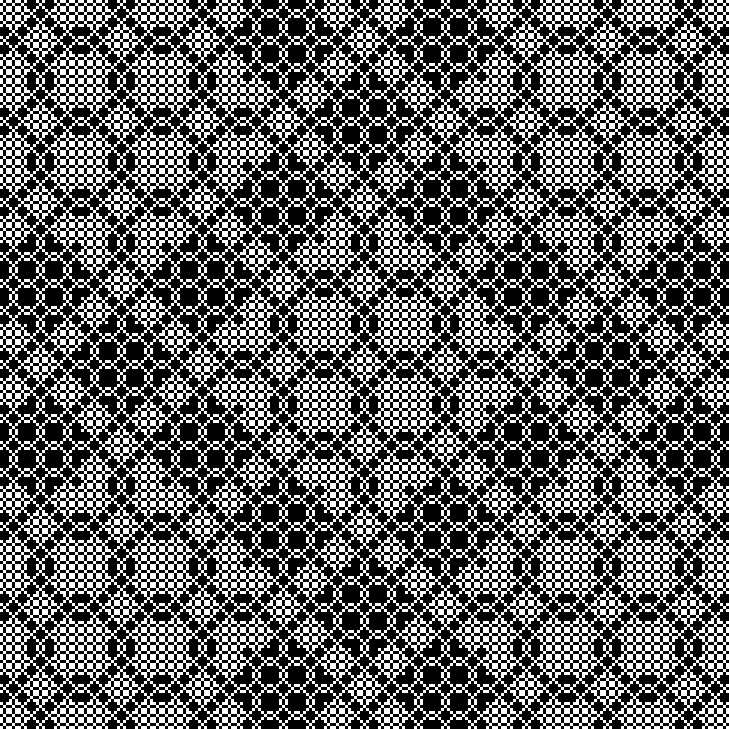
.haferman-6-000000FF

.haferman-6-FFFFFFFF
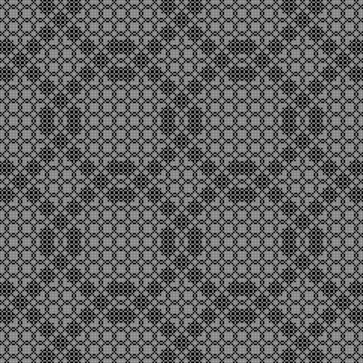
.hodkinson-4-3B175FFF
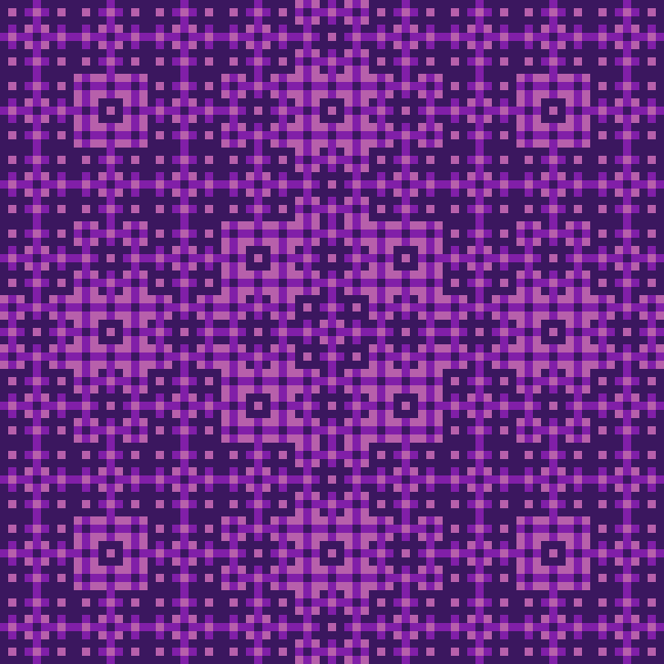
.hodkinson-6-3B175FFF

.nonsymmetric-3-000000FF
image::nonsymmetric-3-000000FF.png[nonsymmetric-3-000000FF,350,350]
.sierpinski-6-000000FF
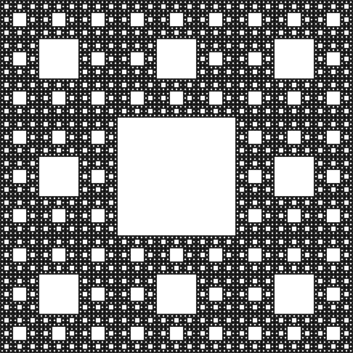
.sierpinski_alt-6-000000FF
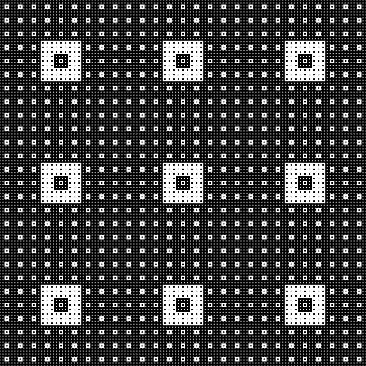
.sierpinski_alt-6-FFFFFFFF
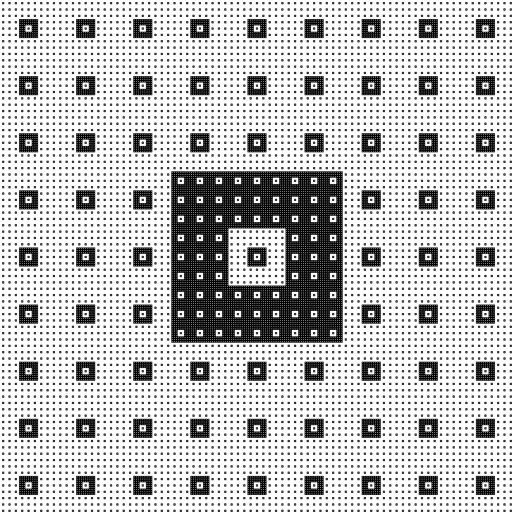
.sierpinski_triangle_alt-4-000000FF
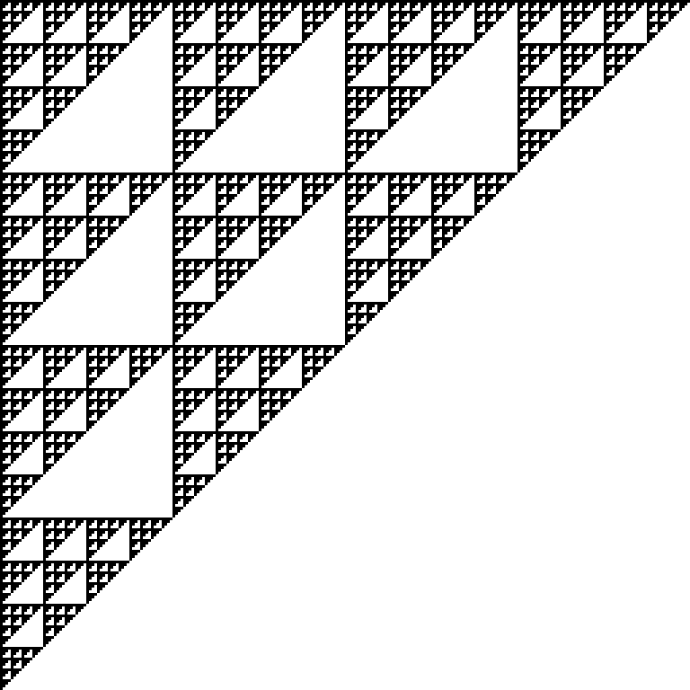
.stained-4-FFFFFFFF
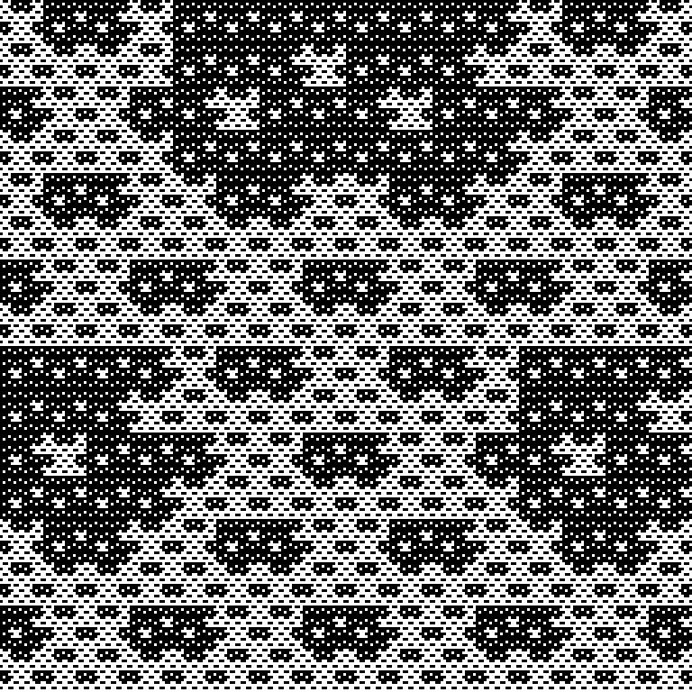
.tictactoe-3-000000FF
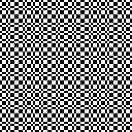
